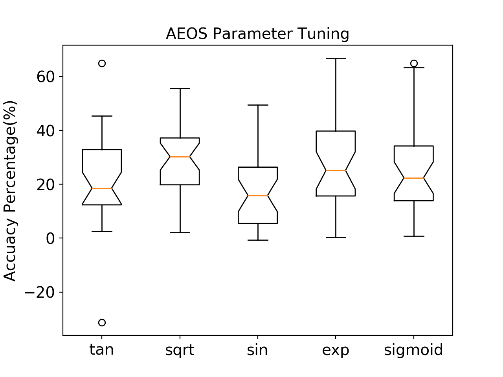

Automated Empirical Optimisation of Parameters in Owl
=====================================================

by Jianxin Zhao

Introduction
-----------------------------------------------------

Recent research on *parameter tuning* mostly focus on hyper-parameter tuning, such as optimising the parameters of stochastic gradient in machine learning applications.
However, tuning code and parameters in low-level numerical libraries is of the same importance.
`ATLAS <http://math-atlas.sourceforge.net/>`_ and the recent `Intel Math Kernel Library <https://software.intel.com/mkl>`_ are both software libraries of optimised math routines for science and engineering computation.
They are widely used in many popular high-level platforms such as Matlab and  TensorFlow.
The reason these libraries can provide optimal performance is that they have adopted the paradigm of Automated Empirical Optimisation of Software, or AEOS.
That is, a library choose the best method and parameter to use on a given architecture to do a required operation.
For example, for linear algebra routines, highly optimised code runs magnitude faster than a naively coded routine.
Naturally, optimised code are usually platform- and hardware-specific. An optimised routine on one machine usually performs bad on the other.

Though `Owl <http://ocaml.xyz/>`_  currently does not plan to improve the performance of the low-level libraries it depends on, as an initial endeavour to apply such paradigm in Owl, one suitable tuning target is the parameters of *OpenMP* used in Owl.

Many current generic computers contains shared memory multiprocessors.
OpenMP is an application programming interface that supports multi-platform shared memory multiprocessing programming in C or Fortran, supported on a plethora of hardware and software platforms.
Owl has already utilized OpenMP on many key math operations to boost their performance by threading calculation.

For example, the figure below shows that when we apply the :math:`sin` function on a N-Dimensional Array (ndarray) in Owl, on my 4-core CPU MacBook, the OpenMP version only takes about a third of the execution time compared with the non-OpenMP version.

.. figure:: ../figure/owl_aeos_sin_perf_mac.png
   :width: 80%
   :align: center
   :alt: omp_sin

However, as is often the case, performance improvement does not come for free.
Overhead of using OpenMP comes from time spent on scheduling chunks of work to each thread, managing locks on critical sections, and startup time that creates threads, etc.
Therefore, when the input ndarray is small enough, or the calculation is simple enough, these overheads might overtake the benefit of threading. A threshold is thus required to decide if use OpenMP or not. The previous practice of using a fixed value for all operations leads to performance deterioration.

Implementation
-----------------------------------------------------

Towards this end, we implement an initial :math:`aeos` module in Owl to tackle this issue.
Our tuning target is basic mathematics operations such as :math:`sin`, :math:`exp`, :math:`log`, etc.
The key idea is simple. We implement two versions of each operation, one using OpenMP and the other not. We then measure their executing time for various sizes of input. After removing outliers, a linear regression is performed to find a suitable input size threshold to decide if using OpenMP or not.

The design of this module focuses on keeping tuning simple, effective, and flexible.
First, the tuning phase should be executed before compiling Owl.
Therefore, the AEOS module should be made independent of Owl, and all the necessary implementation, including math function, regression, utilities etc. are implemented separately to ensure that future changes of Owl do not affect the AEOS module.
Second, each operation is implemented as a single OCaml module, so that support for new operations can be easily added.
Also, we expect that tuning does not have to be only about OpenMP parameters, and that different regression methods could be used in the future. In each module, arbitrary tuning procedures can be plugged in as long as the simple interface is satisfied.

The AEOS module is implemented in such way that brings little change to the main Owl library. The code can be viewed in this `pull request <https://github.com/owlbarn/owl/pull/332>`_, and is now merged into the main branch of Owl. You only need to switch the *ENABLE_OPENMP* flag from :math:`0` to :math:`1` in the `dune file <https://github.com/owlbarn/owl/blob/master/src/owl/dune>`_ to use this feature.

Evaluation
-----------------------------------------------------

To evaluate the performance of tuned OpenMP thresholds parameters, we need a metric to compare two thresholds.
Note that the effect of using the tuned parameters depends on the input sizes, and given two thresholds, any input ndarray of size that smaller than the smaller threshold or larger than the larger threshold can be considered not affected.
Therefore, one metric to measure the difference of two thresholds can be calculated in such way: we generate a series of ndarray, whose sizes grow by certain steps until they reach a given maximum number; for each size that falls between these two thresholds, we calculate the performance improvement ratio of the OpenMP version function over the non-OpenMP version. The ratios are added up, and then amortised by the total number of generated ndarrays.
Hereafter we use this averaged ratio as performance metric.

The figure belows shows the evaluation of a selective operations on a MacBook with a 1.1Ghz Intel Core m3 CPU.
We compare each generated parameter with 30 random generated thresholds. These measured average ratios are then presented as a box plot.
It can be observed that in general more than 20\% average performance improvement can be expected.
Besides, the tuned threshold values vary greatly across different operations and different machines, depending on their computation complexity.

What’s next?
-----------------------------------------------------

As said above, this is an initial effort to apply the AEOS paradigm in Owl. Though the result looks promising, there still exists a large room for improvement.
For example, more operations that require tuning more than just OpenMP parameters could be included. Different regression methods could also be applied. In evaluation, besides performance, stability of the generated parameters might also need to be considered to give a full picture in evaluation.
